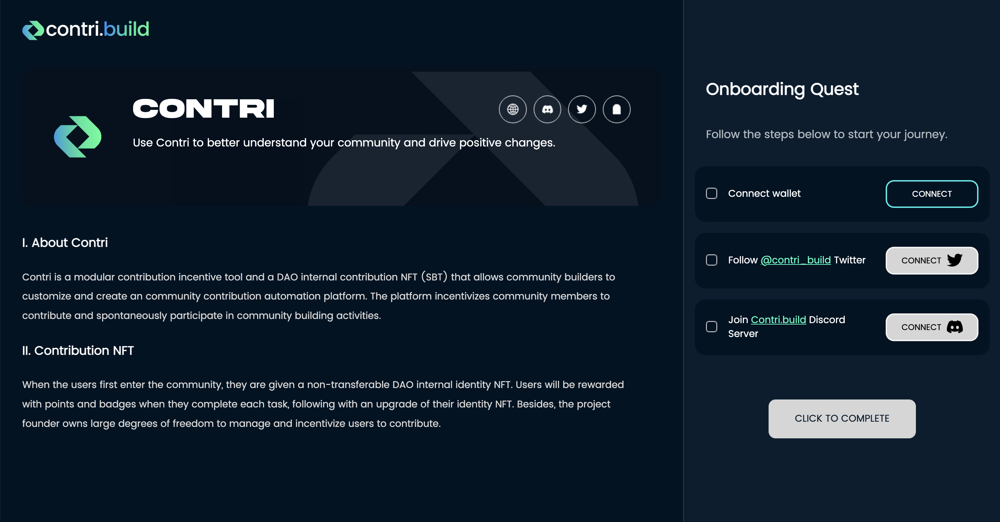

# 📝 Contri SBT Protocol


使用Contri SBT协议发行的SBT就是社区凭证的一种，关于社区凭证，可以查看[这里](../fundamentals/community-credential.md)


Contri SBT协议是无需许可的，允许任何组织发行兼容Contri数据层/社区管理SaaS的SBT，SBT即社区凭证的载体。

用户领取组织发行的SBT之后，这段关系就被铸造在了SBT上。组织可以通过Contri社区管理SaaS生成一个Onboarding的页面，引导用户关注各个社交媒体，领取SBT。

<figure><figcaption></figcaption></figure>

